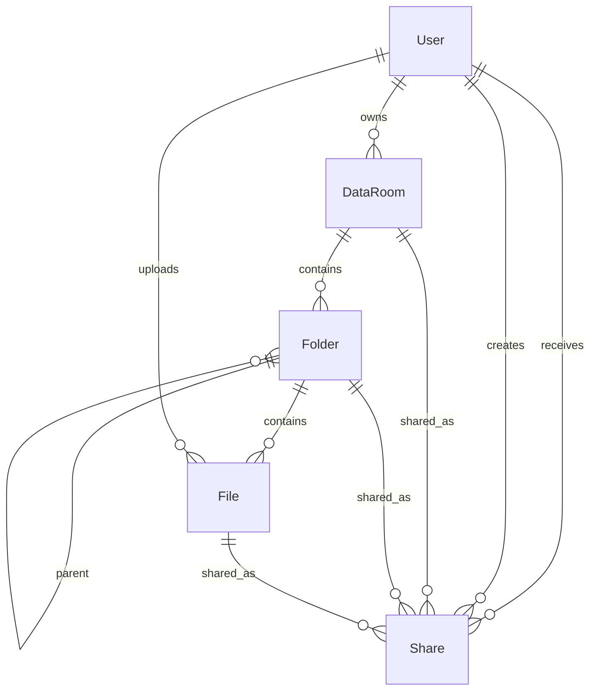

# Vault

Secure Virtual Data Room MVP. Authenticated users create data rooms, nest
folders, upload PDFs to private S3, and share read-only access with specific
users or a public link. Authorization is enforced on the server.

Product brand in the UI: **Vault**.

## Architecture

npm workspaces modular monolith:

```text
React / Vite / Clerk
  → NestJS REST API
      → domain modules (users, data rooms, folders, files, sharing)
      → Prisma → Neon / PostgreSQL
      → AWS SDK v3 → S3 (presigned upload & view)
```

Clerk verifies identity. Nest maps the JWT subject to a local `User`. Postgres
is authoritative for ownership, shares, and resource state. Controllers stay
thin; services own business rules and authorization.

## Stack

- React 19, TypeScript, Vite, React Router, TanStack Query, Tailwind CSS v4
- NestJS, class-validator DTOs, env validation, Helmet, rate limiting, OpenAPI
- Prisma 7 + PostgreSQL
- Clerk (email/password + Google)
- AWS S3 for PDF blobs

## Local setup

Requirements: Node.js 22+, npm 11+, an S3 bucket, and a Clerk application.
Optional: Docker Compose for local Postgres (`compose.yaml`).

```bash
npm install
cp apps/api/.env.example apps/api/.env
cp apps/web/.env.example apps/web/.env.local
# Prefer Neon: pull DATABASE_URL into apps/api/.env, or:
docker compose up -d postgres
npm run prisma:migrate
```

Fill in Clerk + AWS credentials, then:

```bash
npm run dev          # API + web together
# or separately:
npm run dev:api      # http://localhost:3000/api
npm run dev:web      # http://localhost:5173
```

| Surface | URL |
| --- | --- |
| App | http://localhost:5173 |
| API | http://localhost:3000/api |
| OpenAPI | http://localhost:3000/api/docs |
| Health | http://localhost:3000/api/health |

Internal QA checklist: [docs/AUDIT.md](./docs/AUDIT.md)  
ZAP scan notes: [docs/ZAP.md](./docs/ZAP.md)

```bash
npm run build
npm run lint
npm test
npm run playwright:install   # once
npm run test:e2e
```

## Environment variables

Root [`.env.example`](./.env.example) lists the full set. Each app also has a
focused example because Vite and Nest load env files from their workspaces.

**API (`apps/api/.env`):** `DATABASE_URL`, `CLERK_SECRET_KEY`,
`CLERK_PUBLISHABLE_KEY`, `AWS_REGION`, `AWS_ACCESS_KEY_ID`,
`AWS_SECRET_ACCESS_KEY`, `AWS_S3_BUCKET`, `API_URL`, `FRONTEND_URL`, optional
`PORT`, `NODE_ENV`, `ENABLE_SWAGGER`, `AWS_S3_ENDPOINT`.

**Web (`apps/web/.env.local`):** `VITE_API_URL`, `VITE_CLERK_PUBLISHABLE_KEY`.

Never commit secrets. `.gitignore` excludes env files and generated Prisma
output.

## Database

Development uses Neon Postgres. `compose.yaml` remains available for a local
container. Migrations live in `apps/api/prisma/migrations`.

```bash
npx neonctl env pull --file apps/api/.env -s postgres
npm run prisma:migrate
```

`DATABASE_URL` is the pooled connection. Migrations use
`DATABASE_URL_UNPOOLED` when present. Prisma uses `@prisma/adapter-pg`.

## S3

Create a **private** bucket and configure credentials in `apps/api/.env`.

```bash
npm run storage:verify --workspace api
```

IAM for the app user: `s3:ListBucket` on the bucket; `s3:GetObject`,
`s3:PutObject`, `s3:DeleteObject`, `s3:HeadObject` on
`arn:aws:s3:::BUCKET/data-rooms/*`.

Browser uploads need bucket CORS (often set once in the AWS Console):

```json
[
  {
    "AllowedHeaders": ["*"],
    "AllowedMethods": ["GET", "PUT", "HEAD"],
    "AllowedOrigins": ["http://localhost:5173", "http://127.0.0.1:5173"],
    "ExposeHeaders": ["ETag", "Content-Length", "Content-Type"],
    "MaxAgeSeconds": 3000
  }
]
```

Object keys: `data-rooms/{dataRoomId}/files/{fileId}`. Uploads go
browser → S3 via short-lived presigned URLs. Nest does not proxy PDF bodies.

## Clerk

Enable email/password and Google. Allow `http://localhost:5173` as an origin.
Copy the publishable key to both web and API; keep the secret key on the API
only. After first sign-in, `GET /api/users/me` upserts the local `User`.

## Project structure

```text
apps/
  web/          React client (marketing + app shell)
  api/          NestJS API + Prisma
docs/           Audit & ZAP notes
compose.yaml    Optional local Postgres
```

## Data model



- One owner per data room
- Unlimited folder nesting via `parentId`
- Files store metadata + S3 key only
- Shares target exactly one resource and one audience (user **or** public token)
- `nameKey` enforces deterministic sibling uniqueness (`name (n)` / `name (n).pdf`)
- Public tokens: raw token shown once; SHA-256 digest stored

## Authorization

Server-side on every read/mutation:

1. Owner → `OWNER`
2. Direct active user share → role (`VIEWER` in MVP)
3. Active share on the data room or an ancestor folder → inherited read
4. Valid public token → read-only
5. Otherwise deny

File-only shares do **not** grant whole-room browse access. Shared folder
responses clip breadcrumbs and redact `parentId` above the share root.
Mutations require `OWNER`/`EDITOR`; MVP only creates `VIEWER` shares.

## REST API

Interactive docs: `/api/docs` (Bearer = Clerk JWT). Disabled in production
unless `ENABLE_SWAGGER=true`.

- `GET /api`, `GET /api/health`
- `GET /api/users/me`
- `GET/POST /api/data-rooms`, `GET/PATCH/DELETE /api/data-rooms/:id`
- `GET /api/folders/:id`, `GET /api/folders/:id/contents`
- `POST /api/folders/:id/folders`, `PATCH/DELETE /api/folders/:id`
- `POST /api/folders/:id/move`
- `POST /api/files/upload-url`, `POST /api/files/:id/complete`
- `GET /api/files/:id`, `GET /api/files/:id/view-url`
- `PATCH/DELETE /api/files/:id`, `POST /api/files/:id/move`
- `POST/GET /api/shares`, `DELETE /api/shares/:id`
- `GET /api/shared/:token?folderId=`
- `GET /api/shared/:token/files/:fileId/view-url`

Listings are cursor-paginated one level at a time — never a full tree.

## Testing

```bash
npm test                 # API unit tests (authz, names, tokens, cycles)
npm run test:e2e         # Playwright: marketing, FAQ, invalid share, API smoke
npm run playwright:install
```

## Scaling (100k+ files)

- Cursor pagination; one-level lists + breadcrumbs
- Compound indexes on folder/file listings
- Subtree size/count via recursive CTE first; aggregates/closure table later
- Background jobs for large deletes and S3 orphan reconciliation
- Multipart upload when sizes justify it
- `EDITOR` is already in the schema — widen policies without remodeling

## Known MVP limits (say aloud in demos)

- Single-file upload UI (no multi-select / drag-drop progress yet)
- Email share requires the recipient to have signed in once
- File-level share is API-ready; UI exposes room/folder sharing
- No public production deploy in this repo by default
